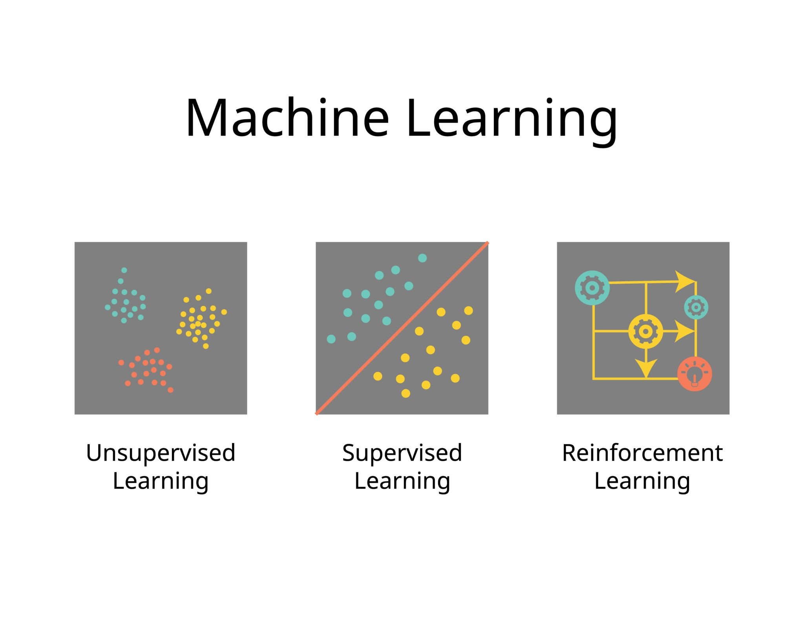
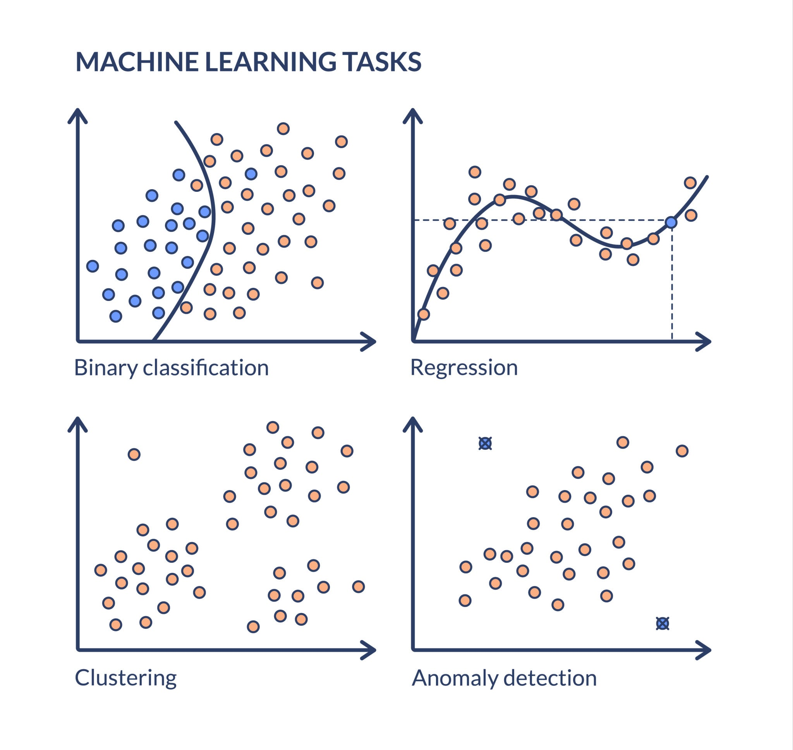

# Machine Learning Methods: Supervised, Unsupervised, and Reinforcement Learning

These three methods are the pillars of machine learning, distinguished mainly by **how they learn** and the **type of data** they use.

## 1. Supervised Learning (The "Student with a Teacher")
The model learns from **labeled data**. It is given input data along with the correct answers (labels). Its goal is to learn a function that maps inputs to outputs so it can predict the answer for new, unseen data.

* **Analogy:** A student learning from a textbook where the answers are at the back. They practice, check the answer, and correct themselves.
* **Key Tasks:**
    * **Classification:** Predicting a category (e.g., Is this email *Spam* or *Not Spam*?).
    * **Regression:** Predicting a continuous number (e.g., Predicting house prices based on square footage).

## 2. Unsupervised Learning (The "Pattern Detective")
The model learns from **unlabeled data**. It is given data without any instructions or correct answers. Its goal is to discover hidden patterns, structures, or relationships within the data on its own.

* **Analogy:** A child playing with a bucket of mixed LEGO bricks. Without instructions, they sort them by color, size, or shape.
* **Key Tasks:**
    * **Clustering:** Grouping similar items (e.g., Segmenting customers by purchasing behavior).
    * **Association:** Finding rules that describe data (e.g., "People who buy bread also buy butter").

## 3. Reinforcement Learning (The "Gamer" or "Dog Training")
The model (agent) learns by **interacting with an environment**. It performs actions and receives feedback in the form of **rewards** or **penalties**. Its goal is to maximize the total cumulative reward over time through trial and error.

* **Analogy:** Training a dog. You give a treat (reward) when it sits and a stern "no" (penalty) when it jumps. The dog eventually learns the best behavior to get the most treats.
* **Key Tasks:**
    * **Control:** Robotics (e.g., a robot learning to walk without falling).
    * **Game Playing:** AI learning to play Chess, Go, or Mario by playing millions of times.

---

### Quick Comparison

| Feature | Supervised Learning | Unsupervised Learning | Reinforcement Learning |
| :--- | :--- | :--- | :--- |
| **Data Type** | Labeled data (Input + Output) | Unlabeled data (Input only) | No predefined data; learns from experience |
| **Feedback** | Direct feedback (Correct/Incorrect) | No feedback; internal evaluation | Delayed feedback (Reward/Penalty) |
| **Goal** | Predict outcomes | Find hidden structure | Maximize reward |
| **Example** | Face Recognition | Customer Segmentation | Self-Driving Cars |
